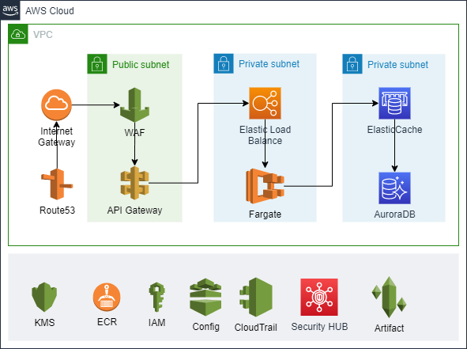

# Zé Connect

## Pré-requisitos

Como requisitos minimos para o ambiente do Z&eacute; Connect, o ambiente deve conter:

<ul>
<li>AWS IAM: gerenciar o acesso pessoal de cada engenheiro a todo ambiente, garantindo que apenas quem tem direito possa ter acesso ao ambiente ou recurso;</li>
<li>AWS SSO: reduzindo o número de logins criados e facilitando o acesso de cada</li>
<li>AWS Systems Manager: configurado para gerenciar os recursos e controlar de forma centralizada obtendo informa&ccedil;&otilde;es através de painéis;</li>
<li>AWS CloudTrail: para registrar e monitorar continuamente o ambiente, a ferramenta possibilita auditorias aos registrar automaticamente logs de eventos de a&ccedil;&otilde;es executadas no ambiente;</li>
<li>AWS Config: A solu&ccedil;&atilde;o permite monitorar de forma centralizada a conformidade do ambiente, gerenciamento de altera&ccedil;&otilde;es al&eacute;m de análises de seguran&ccedil;a;</li>
<li>AWS Security Hub: Centraliza os alertas de seguran&ccedil;a dos servi&ccedil;os GuardDuty, Macie e Inspector.</li>
</ul>

O Zé Connect será uma plataforma escalável, através da API o ambiente poderá ser acessado e adaptado a necessidade atual ou futura do Zé ou da Ambev.

Prevendo um crescimento no número de consulta ao banco de dados, recomendo o ElasticCache para o banco de dados, viabilizando o enfileiramento e tempos de resposta extremamente rápido.

O banco de dados deverá ser referenciado entre as diversas tabelas através de ID do cadastro principal, com isso facilitando o atendimento a Lei Geral de Proteção de Dados Pessoais - LGPD, deverá conter criptografia para armazenamento de dados pessoais.

Todo o ambiente permite a automatização através das trilhas de auditoria e das ferramentas de segurança que foram implementadas, exemplo, através de política é possível evitar que um bucket S3 seja configurado como público, remediando (fechando o bucket) automaticamente caso uma configuração seja alterada indevidamente.

Com as soluções AWS Macie é possível ter visibilidade dos repositórios de dados a fim de encontrar dados pessoais (PII) dentro da infraestrutura do Zé Connect, alertando e podendo ser disparado workflows para remediação.

## Aculturamento em segurança da Informação

Elaboração de um conjunto de documentos de Segurança da Informação, com assinatura de termo conhecimento da PSI e assunção de responsabilidade quanto as diretrizes.

Elaborar uma marca, um visual especifico para todo material relacionado a segurança da informação, ajuda a criar uma identidade visual a todos.

Realização de Workshops de Segurança da Informação, são um bom início e proporciona uma forma de conversar com as diversas equipes, entender as dores e necessidades, abrindo um canal de comunicação com a equipe de SI, comunicados e lembretes relacionados a segurança da informação mantem o tema vivo durante o tempo.

Um projeto de Gameficação de segurança da informação permite descontrair enquanto é tratado o assunto, para isso, o projeto Hacker Ragers é fantástico para atrair o interesse de todos, criar uma competição saudável.

Projeto de acolhimento de novos colaboradores onde em conjunto com RH, podemos abordar o tema segurança da informação desde o primeiro dia na empresa.

Cursos e treinamentos específicos para times, exemplo curso de desenvolvimento seguro.

## Práticas de desenvolvimento seguro

O objetivo é que o desenvolvimento de softwares já protegidos, assim a adoção de segurança como prioridade para as equipes de desenvolvimento. Para isso a adoção de práticas de codificação segura é ideal para o atingimento da meta, para isso OWASP, NIST Secure Software Development Framework, etc.

Automatização de testes SAST desde o analista desenvolvedor reduz o custo e acelera os lançamentos e DAST dentro da esteira para homologação.

Automatização da esteira de homologação até a entrada em produção, visando garantir a menor interferência humana no processo, referenciar o hash da build em todo processo garantindo o rollback da versão.

Por fim, realização de pen-test ao menos 2 vezes ao ano, endereçando todos os apontamentos para correção pela equipe de desenvolvimento.

## Principais dados que o Zé Connect está exposto

O principal dano a que está exposto é o vazamento ou exposição de dados, para isso um controle acurado deve ser feito em toda a infraestrutura e aplicação, a fim de evitar possiveis vulnerabilidades que possam colocar em risco toda a operação, visto que com a entrada em vigor da LGPD, além da multa e outras sansões, pode ser suspenso parcialmente ou totalmente o uso dos dados pessoais.

Os ambientes em nuvem, podem ser vulneraveis a infecção por mineradores de criptomoedas, elevando o custo para organização.

Ataques de negação de serviço, para isso ferramentas como anti-DDOS podem proteger todo o ambiente.

Acesso indevido e falha na revogação de acesso, controles e gestão centralizada para garantir que os acessos sejam revogados assim que o colaborador seja desligado, além de monitorar qualquer acesso irregular ao ambiente.

## Mitigação de riscos

Para mitigação de riscos, é recomendado a adoção de recomentações e framekorks de segurança, como por exemplo:
<ul>
<li>Cloud Security Alliance CSA - Security Guidance v4.0</li>
<li>NIST-  Cybersecurity Framework</li>
<li>NIST - General Access Control Guidance for Cloud Systems</li>
<li>ABNT NBR ISO/IEC 27001:2013</li>
<li>ABNT NBR ISO/IEC 27701:2019</li>
<li>ABNT NBR ISO/IEC 27018:2018</li>
</ul>
